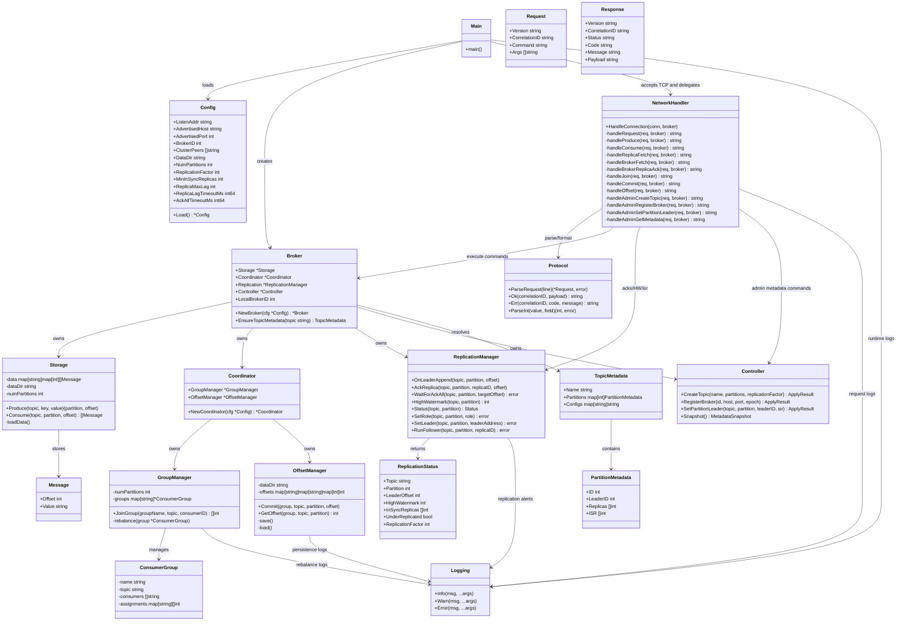

# Class Diagram

This diagram shows the main runtime structures and how requests move through the system.

## How To Read It Quickly

1. `Main` boots `Config`, builds `Broker`, and starts TCP handling.
2. `NetworkHandler` is the request entry point.
3. `Protocol` validates/parses input before business logic runs.
4. `Broker` routes work to:
   - `Storage` for produce/consume
   - `Coordinator` for group membership and offsets
   - `ReplicationManager` for ISR/high-watermark/acks
   - `Controller` for topic/partition/broker metadata
5. `Coordinator` splits responsibilities into:
   - `GroupManager` (partition assignment)
   - `OffsetManager` (persisted consumer progress)
