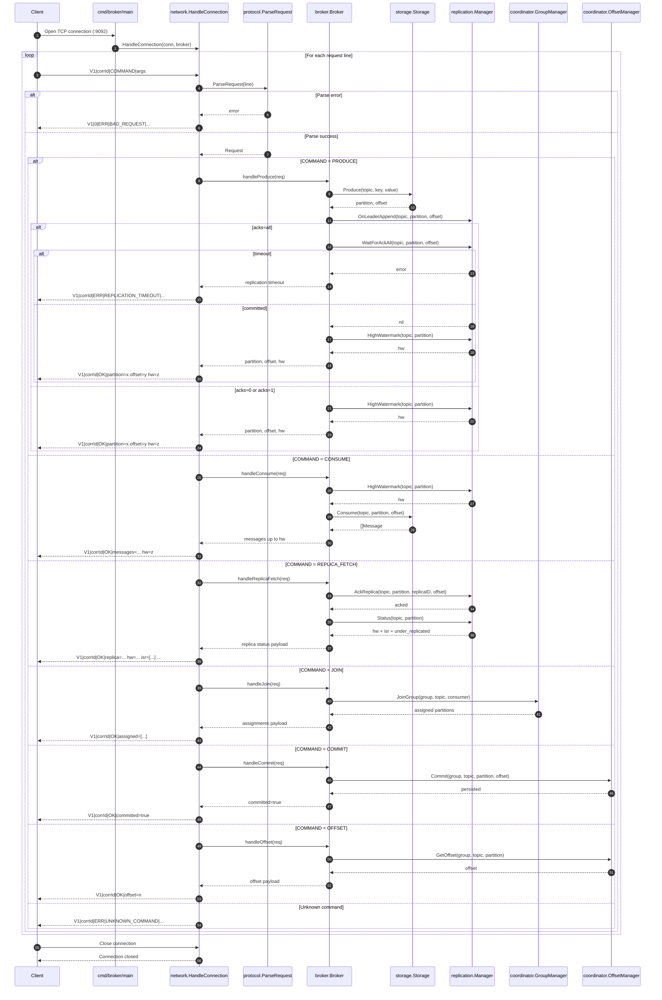

# Sequence Diagram

This diagram shows how a client request flows through the broker.

```mermaid
sequenceDiagram
    autonumber
    participant C as Client
    participant M as cmd/broker/main
    participant N as network.HandleConnection
    participant P as protocol.ParseRequest
    participant B as broker.Broker
    participant S as storage.Storage
    participant R as replication.Manager
    participant G as coordinator.GroupManager
    participant O as coordinator.OffsetManager

    C->>M: Open TCP connection (:9092)
    M->>N: HandleConnection(conn, broker)

    loop For each request line
        C->>N: V1|corrId|COMMAND|args
        N->>P: ParseRequest(line)

        alt Parse error
            P-->>N: error
            N-->>C: V1|0|ERR|BAD_REQUEST|...
        else Parse success
            P-->>N: Request

            alt COMMAND = PRODUCE
                N->>B: handleProduce(req)
                B->>S: Produce(topic, key, value)
                S-->>B: partition, offset
                B->>R: OnLeaderAppend(topic, partition, offset)
                alt acks=all
                    B->>R: WaitForAckAll(topic, partition, offset)
                    alt timeout
                        R-->>B: error
                        B-->>N: replication timeout
                        N-->>C: V1|corrId|ERR|REPLICATION_TIMEOUT|...
                    else committed
                        R-->>B: nil
                        B->>R: HighWatermark(topic, partition)
                        R-->>B: hw
                        B-->>N: partition, offset, hw
                        N-->>C: V1|corrId|OK|partition=x offset=y hw=z
                    end
                else acks=0 or acks=1
                    B->>R: HighWatermark(topic, partition)
                    R-->>B: hw
                    B-->>N: partition, offset, hw
                    N-->>C: V1|corrId|OK|partition=x offset=y hw=z
                end

            else COMMAND = CONSUME
                N->>B: handleConsume(req)
                B->>R: HighWatermark(topic, partition)
                R-->>B: hw
                B->>S: Consume(topic, partition, offset)
                S-->>B: []Message
                B-->>N: messages up to hw
                N-->>C: V1|corrId|OK|messages=... hw=z

            else COMMAND = REPLICA_FETCH
                N->>B: handleReplicaFetch(req)
                B->>R: AckReplica(topic, partition, replicaID, offset)
                R-->>B: acked
                B->>R: Status(topic, partition)
                R-->>B: hw + isr + under_replicated
                B-->>N: replica status payload
                N-->>C: V1|corrId|OK|replica=... hw=... isr=[...] ...

            else COMMAND = JOIN
                N->>B: handleJoin(req)
                B->>G: JoinGroup(group, topic, consumer)
                G-->>B: assigned partitions
                B-->>N: assignments payload
                N-->>C: V1|corrId|OK|assigned=[...]

            else COMMAND = COMMIT
                N->>B: handleCommit(req)
                B->>O: Commit(group, topic, partition, offset)
                O-->>B: persisted
                B-->>N: committed=true
                N-->>C: V1|corrId|OK|committed=true

            else COMMAND = OFFSET
                N->>B: handleOffset(req)
                B->>O: GetOffset(group, topic, partition)
                O-->>B: offset
                B-->>N: offset payload
                N-->>C: V1|corrId|OK|offset=n

            else Unknown command
                N-->>C: V1|corrId|ERR|UNKNOWN_COMMAND|...
            end
        end
    end

    C->>N: Close connection
    N-->>C: Connection closed
```
