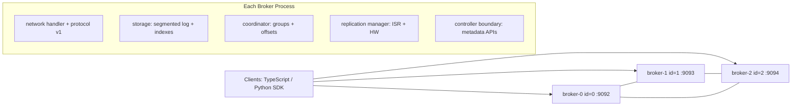

# Topology Diagram

This diagram shows the currently implemented runtime topology using Docker Compose.

## Current State Notes

- Multi-broker node creation via Docker is implemented.
- Each broker has independent data volume and broker identity env vars.
- Control-plane metadata store is still in-memory per broker process (durable distributed controller quorum is planned next).
- Broker-to-broker replication protocol (`BROKER_FETCH`, `BROKER_REPLICA_ACK`) and follower worker loop are implemented as runtime scaffolding.
